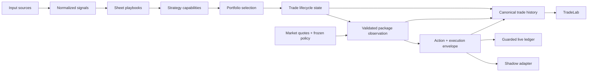

# Kamandal V2 Architecture

Date: 2026-08-24
Status: Multi-broker architecture deployed on Old Mac; Tastytrade authentication and broker-effect proof pending

## Purpose

This document reconciles:

- Suman's operating model
- lessons from `bhiksha`, `mala_v2`, and old `kamandal`
- the external Claude PRD supplied during planning

The goal is to preserve the good ideas without importing complexity that does
not match the current vision.

## Current Architecture Decision: One Strategy Engine

Kamandal is one trading engine. It must not have a permanent "baseline" engine
and a separate "CSA" engine.

The stable model is:



The ownership rule is simple:

- input sources produce normalized evidence and ideas;
- Kamandal code owns executable strategy capabilities;
- the Google Sheet composes a capability into a playbook and selects `shadow`
  or `live`;
- Kamandal owns each trade from candidate through final close;
- the existing guarded live submitter and reconciliation path own broker
  effects; and
- TradeLab reads Kamandal facts and produces analysis. It does not manage trades.

The Sheet/code boundary has one mandatory deployment check. On Old Mac,
`kamandal validate-sheet-policy` reads the canonical Sheet once and compiles
that exact snapshot through the ordinary planner model, the unified capability
compiler, and the retained strict CSA compatibility compiler. The command is
read-only: it does not capture the daily snapshot, touch SQLite, invoke market
data, or call a broker. A failure blocks activation and identifies the contract
that rejected the row. This closes the gap where repository fixtures could be
green while a live Sheet JSON edit made the next natural planner fail.

The unified compiler applies that gate to every enabled row, regardless of its
legacy `csa_stage`. Operator-owned quote and lifecycle controls—including the
profit target, applicable loss boundary, DTE exit, half-time choice, and
earnings choice—must be explicit Sheet values. A blank cell is a policy error;
domain-model compatibility defaults may read historical snapshots but may not
complete a current enabled Sheet row.

Policy compilation remains system-wide and fail-closed today. A malformed
enabled row can therefore block both live and shadow books. Per-lane policy
quarantine is a separate architecture change; it must preserve visibility and
must never allow an invalid live row to be silently skipped.

### Capability versus playbook

A strategy capability is code that knows how to validate, construct, and manage
one lifecycle shape. A playbook is a Sheet row that supplies parameters and
deployment mode for that capability.

The existing `strategy_family` field is the capability registry key. The
`structure` field remains the concrete order shape. They are deliberately
different: `earnings_calendar` and a generic low-IV calendar may both construct
a `call_calendar`, while an `apple_strategy` may reuse an existing structure but
have different eligibility and lifecycle behavior. Capability lookup must never
be inferred from `structure` alone.

The minimal operator contract is:

| Field | Meaning |
| --- | --- |
| `playbook_id` | unique parameterized strategy row |
| `strategy_family` | registered Kamandal capability |
| `structure` | concrete option/order shape constructed by that capability |
| `source_mode` | `idea`, `market_scan`, `portfolio_hedge`, or shadow-only `observed_package`; blank legacy values migrate to `idea` |
| `source_profiles` | explicit correspondent allowlist required only for `observed_package` rows |
| `mode` | `shadow` or `live` effect choice |
| typed parameter columns and management JSON | entry, sizing, and lifecycle policy |

`mode` chooses the shared effect path; it does not supersede a narrower safety
envelope such as `csa_stage=pilot_live`. See
[`docs/lessons/live-mode-normalization-must-preserve-pilot-envelope.md`](lessons/live-mode-normalization-must-preserve-pilot-envelope.md)
before changing mode or stage normalization.

At the initial cutover, the existing `call_calendar_low_iv` and
`put_calendar_low_iv` rows remain generic low-IV calendar capabilities in live
mode. Their fixed DTE windows and earnings blackout must be preserved. They are
not earnings-calendar strategies merely because they construct calendar-shaped
orders.

A live `earnings_calendar` is a separate direction-aware playbook:

- a bullish signal constructs a call calendar and a bearish signal constructs a
  put calendar;
- both legs use the same strike and are routed as one debit complex order;
- at entry, buy the far option with 45-60 DTE and sell the near option with 5-7
  DTE, with the near expiration strictly after the confirmed earnings event;
- enter in the final eligible session before the announcement: the same trading
  day for an after-close event or the prior trading day for a before-open event;
- hold the paired spread through the announcement; and
- close both legs together during the first eligible post-event session, using
  fresh executable multileg quotes. Global emergency and broker-safety rules may
  still force an earlier close.

Unknown or conflicting event date/time blocks entry. This is a single-event,
close-only lifecycle: it does not repeatedly sell new short options against the
far option.

For example, adding an `apple_strategy` means:

1. implement and register the capability in Kamandal;
2. add a Sheet row referencing `apple_strategy` with `mode=shadow`;
3. validate every decision branch with deterministic replay and observe a few
   natural sessions; and
4. change that same row to `mode=live` when the operator authorizes it.

Shadow and live use the same candidate, lifecycle, validated package
observation, action, and execution-envelope code. Only the final execution
adapter differs.

The shadow adapter remains a conservative executable-quote simulation, not an
automatic midpoint fill. Midpoint is the economic observation used to decide;
natural price is separate execution evidence used to determine whether a
protected limit would have filled. A selected entry may be `working` across
natural planning observations, become `open` after a bounded quote-based fill,
or end as `entry_missed` when its frozen attempts are exhausted. Once open,
management and full-position exits use the same lifecycle rules, quote-quality
gate, action reason, execution envelope, and ticket shapes as live, with
broker-free shadow fills as the effect. An invalid or excessively wide quote
cannot create a price-derived decision or fill in either mode. A scheduled or
structural exit obligation remains due, waits for actionable execution
evidence, and escalates if its deadline cannot be met. Live Plan 2 is not a
shadow retry mechanism and may never advance the shadow book. Reports must
retain the complete selected -> working -> filled/missed -> managed -> closed
funnel so executable fill friction is not hidden from alpha analysis.

`mode` and edited Sheet parameters control future entries. When a trade opens,
the lifecycle stores the complete compiled management policy and its hash.
Later Sheet edits, disabling, or deletion do not silently rewrite or orphan that
open trade. Current global safety, market-session, broker, reconciliation, and
emergency rules may still override the stored strategy policy. Adopting a newer
policy for an existing lifecycle is an explicit, versioned operation.

### Package economics are an explicit contract

The unified engine must not let a broker-facing liquidation price double as
its opinion of what a position is worth. Every management observation produces
one small, shared package record before any strategy rule runs:

- close midpoint, computed from every active leg's midpoint;
- close natural price, computed from the executable side of every active leg;
- per-leg and package spread width, quote timestamp, source, and freshness;
- entry and cumulative cashflow, midpoint P&L, and midpoint profit/loss ratios;
- event, DTE, underlying, ownership, and working-order facts; and
- `actionable=true|false` with a stable reason such as `wide_quote`,
  `stale_quote`, `missing_leg`, or `crossed_quote`.

The midpoint is the decision mark. The natural price is liquidity and execution
evidence only. A price-derived profit, loss, or adjustment decision requires an
actionable package observation. The frozen playbook's existing
`max_bid_ask_pct` applies to management as well as entry; a lifecycle must not
silently lose that limit after it opens. A quote outside that limit produces a
hold-and-retry observation, never a price-triggered action.

Midpoint alone is not sufficient when the market is extremely wide. For
example, the observed TLT 79 put market of `$0.15 x $2.70` had a midpoint of
`$1.425`, but neither that midpoint nor the `$2.70` ask was trustworthy enough
to authorize a close. Quote validation therefore precedes midpoint valuation.

### An action carries its reason and its economic boundary

One selected lifecycle action becomes one immutable execution envelope. It
must carry:

- the exact reason and reason class: favorable profit, adverse price loss,
  scheduled lifecycle exit, safety emergency, or risk-changing adjustment;
- the observation identity and midpoint/natural evidence that selected it;
- the initial protected limit, the worst permitted limit, bounded reprice
  steps, and terminal behavior; and
- complete lifecycle, policy, position-projection, and active-leg identity.

This envelope survives translation into both the shadow adapter and guarded
live ledger. The live executor must not reconstruct the reason or economics
from a signed price. Profit-target repricing retains its configured profit
floor; adverse exits may move toward but never through a validated natural
boundary; scheduled exits remain owned until filled or explicitly escalated.
A wide quote never becomes permission to cross the spread.

Price loss is not a hard emergency. The action arbiter may rank it ahead of
ordinary management while still keeping a distinct `adverse_price_loss` class.
True emergencies such as ownership corruption, assignment, or an expiring
unpaired position retain their separate, higher-priority path.

### Management observations are retained, not overwritten

Each evaluated lifecycle appends the package observation, selected action, and
execution-envelope identity to canonical history. Repeated holds are useful
evidence and cannot collapse into one idempotent action row or only the latest
lifecycle metadata. Both live and shadow tickets, fills, retries,
reconciliation outcomes, and terminal economics join that same history; Live
Book and weekly TradeLab reporting read this canonical evidence rather than a
retired mark table. This is the minimum evidence needed to answer: what quote
was seen, whether it was usable, why an action was or was not selected, what
limit was authorized, and what eventually filled.

The Sheet contains typed parameters, not executable strategy code. A parameter
variant is another row. A genuinely new entry shape or lifecycle behavior is a
new Kamandal capability.

### Input sources are profiles, not trading lanes

X, YouTube, My Ideas, correspondent profiles, market scans, and portfolio needs
all normalize into a common signal contract. Adding another correspondent
normally adds a collector/profile/translator, not another planner or manager.

When a correspondent publishes an exact option package as an image, the first
normalized object is evidence rather than an idea. Birdclaw preserves the
sanitized public post and media; Agent Broker transcribes the bounded image;
Kamandal deterministically validates exact legs into `ObservedPackageEvidence`
and appends every revision to a passive ledger. A complete opening enters the
one planner only through a shadow-only `observed_package` playbook that
explicitly allows the source profile and exact structure. Kamandal quotes and
validates those source legs without rebuilding them. The existing optimizer may
reject or not select the package; only a selected package uses the existing
shadow adapter and unified manager. Close/roll/adjust posts remain benchmark
facts and cannot manage the Kamandal lifecycle. See
[Observed Package Evidence](OBSERVED_PACKAGE_EVIDENCE.md).

Normalization may be one-to-many. A source profile with a stable numbered
grammar may expand one announcement into several distinct template signals
while retaining one source ID and separate template identities. For example,
Greg Harmon's earnings announcement expands deterministically into Ideas 1--4
using the declared profile map; inaccessible subscription content and bonus
ideas are neither fetched nor invented. Each resulting structure then passes
the ordinary compatibility and portfolio gates independently.

A correspondent translator asks the configured LLM one bounded question: does
this post introduce a new `enter` opportunity, an `update`, an `exit`, or
`ignore`? Here `enter` means "investigate now or retain as a conditional watch,"
not "place an order." The answer also contains symbol, direction, an optional
strategy hint, and one short reason. Only `enter` may continue toward a planner
idea. The application already knows and attaches the source, post text,
timestamp, correspondent, and interpreter identity; the model is not asked to
reproduce an audit packet. Profiles select one posture: `explicit_only` or
`inference_allowed`. This is prompt policy, not temperature tuning or a matrix
of confidence thresholds.

When a profile declares an exact recurring bundle grammar, that declaration may
deterministically establish `enter` and the numbered strategy families. This is
the same principle as extracting multiple ideas from one YouTube transcript:
collectors differ, but normalized ideas and downstream ownership do not.

A source profile also decides whether it needs external market evidence. When it
does, Kamandal sends a small, versioned question to Market Cartographer. The
question contains a symbol, source claim, provenance, and optional direction
hint. Cartographer returns point-in-time direction, trigger, invalidation, and
evidence with `planner_eligible=false`. Cartographer does not know Greg's trading
rules, select an option structure, or manage a position. Kamandal stores the
answer, applies the source profile, and chooses compatible Sheet-enabled
playbooks through the ordinary portfolio planner.

An `insufficient_evidence` answer is still a valid, useful response. Market
Cartographer persists that response and may exit with status 2; Kamandal accepts
the artifact as negative chart evidence, validates it normally, and parks only
the dependent ideas. Exit codes other than 0 or 2 remain transport/runtime
failures.

Therefore profiles understand people, Cartographer understands charts, and
Kamandal understands strategies and the portfolio. A future correspondent can
ask the same market question, ask none, or later use another source-neutral
question type without creating another planner or lifecycle engine.

Authored ideas may carry thesis tags. A `market_scan` is different: it is a
quantitative search requested by an enabled playbook, so its IV, liquidity,
event, price, structure, and portfolio gates determine eligibility. It must not
invent human thesis tags merely to satisfy the playbook it is scanning for.

### Universe renewal is a governed feedback loop

The enabled universe is a trading-safety allowlist, not an extraction filter.
Kamandal must preserve a valid mention or thesis even when its symbol is not yet
approved for trading. The universe check decides what happens next:


This is intentionally a one-way human gate. The watchdog may collect, dedupe,
rank, and propose a symbol, but it may never make that symbol tradable. An
approved symbol becomes eligible only after the operator completes its universe
policy (profile, playbook permissions, and risk fields) and changes
`enabled=TRUE` in the existing `universe` tab. No new Sheet tab or approval
application is required.

Activation is fail closed. Blank `enabled` never means true. A proposed row can
enter planning only when it has literal `enabled=TRUE`, a reviewed tier other
than `proposed`, `held`, or `rejected`, and explicit valid values for profile,
IV eligibility, maximum BPR, maximum positions, earnings sensitivity/event
windows, and allowed playbooks. A flip on an incomplete proposal fails config
validation rather than inheriting permissive model defaults.

The minimum durable candidate record contains the symbol, first and last seen
times, mention count, distinct source profiles, evidence references, and the
reason it was excluded from planning. Each observation has a stable identity
derived from the source profile, immutable source-record identity, and symbol,
so replaying the same packet cannot inflate counts. Source normalization writes
this evidence transactionally; it does not wait for a separate daily collector.

The Friday review uses the half-open interval after the last successfully
committed universe review through the current review cutoff. The first run uses
the previous five completed trading sessions. A missed/holiday week is therefore
recovered without double counting. Before publication, deterministic market
checks add price, average dollar volume, optionability/options-liquidity facts,
and market capitalization when available. A default maximum of five ranked new
proposals per review keeps the operator surface useful. Ranking is transparent:
recurrence, then source diversity, then recency, then tradability. These are
discovery facts, not an alpha score.

The existing five-tab Sheet remains the operator surface. Proposed rows use
`tier=proposed` and `enabled=FALSE`; the operator may change the tier to `held`
or `rejected`, still disabled. The publisher never recreates held/rejected
symbols and may update only machine-owned proposal fields, never operator policy
or notes. Any automatic append must be a bounded row operation that preserves
headers, formulas, formatting, and validation and then reads back the exact
rows. It must not clear and rewrite the entire universe tab.

The Friday universe projection is deterministic and failure-isolated from the
existing LLM rejection review. Both may share the Friday launchd wrapper, but
one component cannot silently suppress or duplicate the other. Status reports
four outcome counts separately from process health: evidence observations,
unique outside-universe candidates, candidates passing tradability checks, and
rows published.

At the August 15 architecture review, the implementation was scheduled but not effective. On deployed oldmac,
the universe proposer naturally returned `status=ok` with zero proposals on
every weekday from August 7 through August 14, 2026. The Sheet still contained
85 enabled rows and no proposed rows, and the 780 stored ideas contained no
out-of-universe symbol. This is explained by the code path:

- My Ideas rejects a non-universe ticker before materializing an `Idea`;
- the active X and YouTube jobs explicitly filter extraction to enabled symbols;
- correspondent translation records an outside-universe blocker but publishes
  only planner-eligible ideas to the active idea store;
- the proposer advertises a three-day lookback but reads one overwriteable
  `latest_plan_run.json`, then falls back to the already-filtered idea store; and
- the Friday rejection reviewer does not aggregate or project universe
  candidates for operator review.

Therefore a green proposer job proves only that its schedule and process worked;
it does not prove that the universe-renewal loop produced useful evidence.

The existing playbook field `universe_expansion_enabled` is unrelated to this
feedback loop. Today it only lets the short-strangle playbook scan more broadly
inside the already enabled universe by bypassing per-symbol playbook allowlists.
The unified policy should rename or clearly alias that meaning (for example,
`universe_wide_scan`) so it cannot be mistaken for permission to add symbols.

### Entry and management use reason-aware time permissions

Session policy is shared platform behavior, not strategy-specific logic. It
uses the action's reason class rather than treating every close as equally
urgent:

| Central time | Entry / adjustment | Favorable profit | Adverse price loss | Scheduled exit / safety emergency |
| --- | --- | --- | --- | --- |
| 08:30-09:00 | blocked | allowed on an actionable quote with a protected limit | observe only; opening observations do not count toward confirmation | allowed on an actionable quote; unresolved emergency escalates |
| 09:00-14:40 | allowed | allowed | allowed only after the configured valid-observation confirmation | allowed |
| 14:40-14:55 | blocked | allowed on an actionable quote with a protected limit | observe only | allowed on an actionable quote; unresolved emergency escalates |

`Scheduled exit` means that the lifecycle clock itself is due, such as a
confirmed post-earnings exit, DTE/half-time exit, or expiry action. It does not
mean that any loss-making position becomes urgent. A price-based stop cannot be
relabeled as an emergency merely to bypass the opening or closing buffer.

Extended-session symbols retain their configured close time and buffer. The
broker-facing submission guard, not only the wake-up schedule, enforces these
permissions.

Planning may run before 09:00. A selected entry encountered before the entry
window remains in a retryable `waiting_entry_window` ledger state; this is normal
machine-owned work, not a failure or operator alert. The executor picks it up on
its next scheduled tick. Because the original ticket will then be stale, the
existing bounded recovery path rebuilds the current rank-one plan and repeats
health, risk, session, quote, and broker preflight checks before any submission.
Waiting entries from a prior market day are retired rather than carried forward.

The unified manager also preserves the existing Sheet-owned exit clocks for
every ordinary close-oriented capability, directional diagonal, and short
strangle:

- `half_time_exit=TRUE` closes the complete active package when the earliest
  active expiration reaches half of its DTE at the completed opening fill;
- `exit_pre_event_days=N` closes the complete active package when the latest
  captured earnings date is within `N` calendar days; and
- the explicit DTE exit reason wins when both DTE and half-time are due, while
  the pre-event exit retains higher safety precedence than profit/time exits.

These are shared context rules, so the same frozen lifecycle policy drives live
and shadow. The specialised earnings-calendar capability is intentionally
different: it holds through its confirmed event and uses its first eligible
post-event exit contract rather than the ordinary pre-event rule.

### Resting profit targets are canonical lifecycle state

The unified manager can represent an exact full-package profit offer before the
midpoint has reached the final target. This is a platform action, not another
strategy manager and not another valuation rule:

- a fresh, complete, non-crossed package midpoint must first make the
  Sheet-authorized progress toward the lifecycle's frozen profit target;
- the closing limit is calculated from original target-profit dollars and the
  lifecycle's cumulative filled cashflow, so filled adjustments change the
  remaining close price without changing the original target dollars;
- the target is one atomic package `close` ticket with reason class
  `resting_profit`, DAY duration, and an execution envelope whose initial and
  terminal boundary are both the exact strategy target;
- it never enters the midpoint-to-natural close reprice ladder;
- one working target suppresses duplicate target tickets but remains visible to
  the same manager, which may supersede it for a higher-priority emergency,
  event, executable-profit, time, confirmed-loss, or allowed lane-adjustment
  action; and
- a live supersession persists the child and lineage before requesting cancel,
  waits for terminal unfilled parent state, verifies the owned position and
  fresh preflight, and only then submits. A parent fill aborts the child.

The playbook Sheet owns `resting_profit_enabled` and
`resting_profit_arm_progress_pct`; both values freeze when the lifecycle opens.
The runtime live/shadow flags are upper-bound kill switches only: they may stop
the action but may not authorize it or rewrite an existing lifecycle.

Shadow uses the same observation, action, price, and typed ticket. Its effect
adapter keeps one non-conceding working order per valid market observation,
expires that DAY identity at the date boundary, and re-arms on a later valid
cycle. Live and shadow activation are independent and disabled by default.
Therefore source publication or deployment alone cannot create a broker order.

### Management permissions are capability-specific

One lifecycle engine does not mean every strategy may perform every action.
Each registered capability declares the actions and ticket shapes it permits:

| Capability | Open | Ordinary management | Exit |
| --- | --- | --- | --- |
| Short strangle | sell short put and short call together | bounded replacement of the untested short side; optional separately configured duration/inversion branches | buy back both currently active short legs together |
| Call vertical | open both spread legs together | hold or close only | close both current legs together |
| Directional diagonal | open far long and near short together | hold or close only; no ordinary short-leg resale/roll | close both current legs together |
| Generic calendar | open far long and near short together | established close-only rules | close both current legs together |
| Earnings calendar | open event-relative far long and near short together | hold through the confirmed event | close both current legs together after the event |

The short strangle is the deliberate exception to close-only multileg
management. It has two short options, not a “long leg” and a “short leg.” When
one strike is breached, the other option is the *untested side*. Replacing that
side is economically a one-side adjustment but operationally a paired roll:

- if the short put is tested, buy to close the current short call and sell to
  open a new short call closer to the stock;
- if the short call is tested, buy to close the current short put and sell to
  open a new short put closer to the stock;
- submit those close/open effects as one complex replacement ticket with the
  same option type, expiration, quantity, and lifecycle role;
- leave the tested leg unchanged; and
- after a complete fill, reconcile exactly two active short legs and no increase
  in short-contract count. A one-leg fill/state is an execution incident, not a
  valid strategy state.

For the initial `short_strangle_high_iv` shadow policy, a side is tested when the
underlying is at or beyond its short strike for two consecutive management
observations on the **same side**. A side change or return inside both active
strikes resets confirmation. One filled replacement consumes that tested
episode; the same continuing breach cannot walk the untested leg inward again.
The capability re-arms only after two consecutive observations back inside the
active strikes or after a later distinct tested episode.

The replacement selector uses management policy, not the 0.14-0.20 entry-delta
range. It chooses the closest liquid non-crossing strike to absolute 0.30 delta,
never above the Sheet-configured 0.40 management maximum, strictly inward from
the current untested strike, and only for a net credit of at least $0.10 per
share. It observes a 30-minute cooldown after a filled adjustment. A maximum of
two successfully filled side replacements across the lifecycle is the initial
operator safety/experiment limit; rejected, cancelled, expired, or unfilled
tickets do not count. Two is not asserted as a universal tastylive rule.

Working-order or ownership ambiguity blocks action. Emergency, mandatory event,
profit, configured loss, and DTE exits outrank an adjustment. Adjustments are
risk-changing trades and run only during the normal entry/management window;
they are not allowed in opening or closing exit-only windows.

At initial cutover, `dte_action=close` at 21 DTE. The existing duration-roll
branch must not compete with that close. A future Sheet policy may instead
select a whole-position duration roll, but only with its own limit and an atomic
four-effect ticket that closes both current legs and opens both later-dated
legs. Bounded inversion remains a supported but initially disabled policy branch
until its remaining-profit and adjusted-target economics pass deterministic
proof and the operator explicitly enables it.

Ordinary adjustment economics retain the Sheet's 40% target as a dollar target
based on the original opening credit. Filled roll credits update cumulative
cashflow, breakevens, and the required closing debit; they do not silently turn
40% into tastylive's commonly discussed 50% target. Final exit always closes the
two legs that are active after all filled replacements.

## Merge Decision

The current implementations each contain one part worth keeping. Neither should
replace the other wholesale.

| Current component | Keep | Replace or absorb |
| --- | --- | --- |
| Established planner | idea matching, candidate construction, portfolio-bundle optimization | baseline-only policy routing |
| CSA strategy lanes | typed opportunity, lifecycle, action arbitration, mixed-leg tickets, shadow/live adapters | CSA identity, independent scan/management ownership |
| Existing live pipeline | health, account risk, BPR, broker preflight, submission windows, serialization, reconciliation | close-only strategy management |

### Corrective salvage decision

The topology cutover was directionally correct, but its proof focused on owner,
policy, lane-action, and ticket joins. It did not prove parity from raw quotes
through the final broker-facing price. Several earlier live protections were
therefore left in the retired manager instead of being absorbed into the
canonical lifecycle owner.

| Capability | Earlier live behavior | Deployed unified behavior | Architecture decision |
| --- | --- | --- | --- |
| Economic mark | midpoint P&L with natural price retained separately | natural liquidation price drives P&L and loss multiple | absorb midpoint/natural separation into the shared package observation |
| Quote quality | freshness, missing-leg, and wide-spread checks before adverse action | a fetched leg quote is treated as usable; no management spread gate | apply frozen `max_bid_ask_pct` and explicit quote validity before every price-derived action |
| Loss confirmation | repeated midpoint loss-watch observations; wide quote blocks close | one natural quote can immediately select a loss exit | restore confirmation using only valid observations inside the normal management window |
| Exit execution | reason, natural endpoint, and profit floor reach the close repricer | typed translation drops the reason/economic bounds; close starts at natural | carry an immutable reason-aware execution envelope through both adapters |
| Forensic history | append-only live marks preserve observation payloads | lifecycle metadata keeps only the latest mark and duplicate holds collapse | append every package observation and join it to action, ticket, and fill |
| Session permission | generic close window; no complete favorable/adverse distinction | generic close window remains, including price stops at 08:30 | add the reason-aware time matrix above; this is a new requirement, not a legacy restoration |
| Same-day exits | blanket block unless globally overridden | canonical typed closes bypass that blanket | do not restore it; quote quality and reason-aware permissions are the correct controls |
| Ownership and effects | ledger drain, broker preflight, reconciliation, health, and attention-only escalation | preserved behind the guarded effect boundary | keep; do not build a second submitter or manager |

Already-repaired cutover regressions remain part of the required contract:
live/shadow book identity, quote coverage for owned expirations, Sheet-owned
half-time and pre-event clocks, terminal lifecycle/projection convergence,
complete order-lineage ownership, and pricing-envelope preservation for entry
replacements and Plan 2. They must stay in the regression suite even though no
new implementation is required for them in this correction. For entry-side
liquidity parity, see
`docs/lessons/shadow-liquidity-policy-must-match-live-selection.md`.

The old live manager is evidence and reusable mechanics, not a runtime to
revive. The repair absorbs the behaviors above into the one canonical manager,
then leaves the duplicate manager unreachable from scheduled operation. This is
not a literal code copy: the old blanket same-day block and the old urgent-close
behavior that could price through natural are not restored.

The resulting engine has three parts:

1. **Selection brain:** the established portfolio planner evaluates all enabled
   playbooks and chooses separate live and shadow plans. One invocation may run
   both books, but they have independent candidate sets, portfolio state,
   results, and failure receipts. Every persisted account snapshot carries an
   explicit `live` or `shadow` book identity; live risk and health may read only
   live history. Shadow cannot consume or veto live capacity.
2. **Lifecycle brain:** the generalized strategy-lane machinery owns opens,
   holds, adjustments, rolls, and closes for every selected trade.
3. **Effect boundary:** shadow simulation or the existing guarded live ledger,
   submitter, and reconciliation path.

### One brain, multiple execution venues

Kamandal remains one application and one portfolio/lifecycle brain. The
`execution_venue` playbook field chooses a broker route for each new candidate;
that value is then frozen through candidate, lifecycle, strategy ticket, broker
ticket, receipt, replacement, position projection, and close. Market-data
observation may still come from the shared read-only provider, but broker
preflight, submission, order status, and account-local buying-power checks use
the ticket's venue for live execution. In shadow, a broker dry run may supply
exact-leg BPR evidence, but the real broker account's balance, buying power, or
permission level cannot veto the simulated trade. Invalid legs, malformed
orders, missing or unusable quotes, and all other strategy/safety failures
remain blocking in both modes.

`public_primary` maps to Public and `tasty_primary` maps to Tastytrade. A Sheet
flip changes future entries only. It cannot migrate an existing position and it
cannot change the broker used for that position's management. The portfolio
optimizer sees aggregate family exposure while also enforcing account-local
buying power, so capital at one broker cannot authorize an order at another.
Order reconciliation follows the frozen venue independently for every ticket;
an unavailable venue is reported and never replaced with the process-default
broker.

The short-strangle lane is currently `shadow`, even though its future venue is
`tasty_primary`. Promotion to live remains a separate money gate and requires
broker-native canary proof; this deployment does not submit an order.

#### Order identity and replacement

Every broker ticket carries two identities. `client_order_id` (also retained in
the compatibility `order_id` field) is deterministic and immutable; it owns
idempotency, ticket hashing, and replacement lineage. `broker_order_id` is
assigned by the execution venue and is persisted immediately after a successful
submission. Every later GET, cancel, or replace call addresses the broker id.
This separation is required because Public can echo a client UUID while
Tastytrade normally returns its own numeric order id.

An atomic Tastytrade reprice is `replacement dry-run -> PATCH current order`.
The Orders API has its own pinned `Accept-Version`; that header is not leaked
onto OAuth or unrelated API surfaces. An adapter that explicitly declares it
cannot replace atomically enters the staged-cancel state machine: persist the
child, request cancel, observe a terminal unfilled parent state, verify the
position for a close, preflight again, and only then submit. A cancel request or
unknown status is never terminal proof.

Atomic replacement ticket versions are aliases of one economic broker order,
even when their immutable local client IDs differ. Fill projection therefore
keeps the maximum cumulative quantity across that proven alias set rather than
summing ticket observations. Reconciliation may correct a historical
overcount automatically only when the atomic lineage, exact OCC legs, and
broker quantities all agree; generic quantity mismatches remain human-review
cases.

#### Account and reconciliation isolation

Live Tastytrade account operations require an explicit configured account
number and pinned Orders API version in addition to OAuth availability. Cached
or first-returned account discovery may support non-effectful research, but it
cannot authorize live account state, positions, or orders.

Reconciliation inventories every venue implicated by an open group or working
ticket. Its internal key is `(execution_venue, OCC symbol)`, not OCC symbol
alone. Therefore the same contract at Public and Tastytrade remains two
independent holdings. Failure to read any required venue suppresses automatic
projection repair and emits `broker_venue_unavailable`; missing inventory is
never interpreted as a flat account.

#### Market data is not order routing

The current quote/Greek surface remains the shared Public/fixture market-data
provider. Tastytrade owns its venue's dry-run, account, order, and position
receipts, but Kamandal does not yet consume DXLink quotes. That is an explicit
live-pilot constraint, not a requirement to build another account. The already
configured production account has produced exact-leg dry-run BPR receipts during
natural shadow planning. Fresh shadow reachability plus an immediate production
account/capacity/dry-run readback precede a separately approved one-contract
canary using current live quote evidence. A separate certification sandbox is
optional because it cannot prove production fill quality or alpha.

#### Tastytrade readiness is an explicit ladder

The checked-in Tastytrade default follows the documented production host,
`https://api.tastyworks.com`; sandbox uses
`https://api.cert.tastyworks.com`. The Orders API version is independently
pinned to `20260427`. Runtime environment overrides are reported rather than
silently rewritten, because changing a credential-bearing runtime file is an
operator action.

`kamandal tastytrade-readiness` is broker-inert: it reports configuration
gaps and builds representative two-leg open, two-leg close, mixed adjustment,
and replacement payloads without authentication or network use. The secure runtime
configuration helper accepts credentials through hidden prompts, atomically
writes a `0600` environment file, and never prints values. The existing production
OAuth/account configuration and natural `tastytrade_dry_run` BPR receipts satisfy
the setup boundary; fresh account/capacity readback, the bounded production canary,
and Sheet promotion remain separately authorized gates. See
[TASTYTRADE_LIVE_HANDOFF.md](TASTYTRADE_LIVE_HANDOFF.md).

For Kamandal's personal OAuth application, the refresh exchange uses the
client secret and the user grant's refresh token. A client id is not required;
short-lived access tokens are generated automatically at runtime.

### Autonomous short-strangle admission

The Sheet is authoritative for the volatility, DTE, delta, profit, time, event,
and loss controls. The current intended policy is IV percentile 70-100,
IV rank 50-100, 35-50 DTE with target 45, 14-22 delta, 40% profit, exit at 21
DTE, pre-event exit at five days, and a 3x package-loss close.

Kamandal does not require current-range evidence from Market Cartographer. The
retired rule confused a description of recent price containment with a forecast
of future realized movement and caused missing or insufficient chart data to
block otherwise valid shadow evidence. Short-strangle admission instead begins
with the options-economic thesis: premium, implied movement, liquidity, DTE/delta,
events, BPR, and portfolio risk. Cartographer may later supply a forward-looking
`TUSSLE_EXPECTED` annotation, but it remains non-blocking until a controlled
comparison shows incremental economic or risk value over that baseline.
See
[`docs/lessons/current-range-is-not-a-short-strangle-entry-edge.md`](lessons/current-range-is-not-a-short-strangle-entry-edge.md)
for the reusable decision test and rejected alternatives.

This direction matters because the CSA scanner currently selects the best
candidate inside each opportunity; it does not replace the established
portfolio-bundle optimizer. Conversely, the established live manager mainly
constructs full closes and cannot be the extensible home for mixed-leg
adjustments without recreating the lifecycle machinery.

## Smallest Coherent Cutover

This is one bounded cutover, not a long-lived hybrid. The implementation may be
split into reviewable commits, but it is deployed as one ownership change after
the complete cutover test passes.

| Change | Value now | Future value | Required? |
| --- | --- | --- | --- |
| Compile every enabled Sheet row into one playbook policy with `mode=shadow|live` | removes baseline/CSA routing ambiguity | every new capability gets the same switch | yes |
| Put the existing portfolio optimizer in front of all capability builders | preserves current live selection quality | new strategies automatically compete at portfolio level | yes |
| Generalize the typed CSA lifecycle/action/ticket contracts and remove CSA from public names | one manager dispatches only the actions permitted by each capability | Apple-like capabilities plug into one interface without inheriting unrelated roll behavior | yes |
| Route every lifecycle ticket through either the shadow adapter or existing guarded live ledger | live and shadow exercise the same logic | promotion is one Sheet change | yes |
| Backfill every currently open Kamandal position into a lifecycle with one proven owner | prevents unmanaged or double-managed positions at cutover | one canonical history | yes |
| Replace separate baseline/CSA scan and management jobs with unified planning and management jobs | eliminates duplicate clocks and ownership | simpler operations | yes |
| Add the authoritative entry/exit time permissions above | captures opening/closing exits without opening new risk | applies automatically to future strategies | yes |
| Preserve out-of-universe evidence and produce a bounded weekly proposal queue in the existing `universe` tab | lets current idea flow refresh a three-year-old allowlist without making unapproved trades | every future source profile contributes to universe discovery automatically | yes |
| Expose canonical lifecycle history through read-only JSON | TradeLab can report what Kamandal did and how it ended | transport can later become an API without changing semantics | yes |
| Rename existing persisted `csa_*` tables immediately | no trading or diagnostic improvement | cosmetic consistency only | no |

The final row is an explicit non-change. Existing table names may remain as a
legacy physical-storage detail if rewriting them adds migration risk. Public
commands, types, reports, and operational ownership must use the generic
strategy language after cutover.

## Legacy Retirement Boundary

The unified engine is not complete if a generic command merely wraps the old
baseline and CSA decision engines. A wrapper may be useful during an atomic
cutover, but it is not an acceptable steady state. The final runtime has one
policy compiler, one planning path, one lifecycle-management path, and one
effect boundary. `shadow` and `live` are inputs to those paths, not separate
implementations.

Legacy material is treated in three different ways:

| Kind | Target treatment | Reason |
| --- | --- | --- |
| Active legacy behavior | remove | Old validators, defaults, routing, scanners, managers, and CLI branches can contradict current Sheet policy or create a second owner. |
| Proven reusable mechanics | generalize and absorb | Lifecycle state, action arbitration, mixed-leg tickets, strangle replacement, shadow fills, and reconciliation-aware execution are capabilities the unified engine needs. Their behavior stays; CSA-specific public identity does not. |
| Historical or migration state | isolate and retain while needed | Existing lifecycles, cashflows, lineage, and physical `csa_*` tables protect open-position ownership and TradeLab evidence. They may be read through generic store interfaces, but they do not interpret current policy. |

The active scheduled commands must not import or dispatch to deprecated CSA
scanner or management entry points. In particular:

- unified lifecycle management owns one ordered recovery cycle: synchronize
  broker orders, evaluate the `live` branch, drain its guarded close/adjust
  tickets, synchronize and clean up, and only then evaluate the broker-inert
  `shadow` branch. A lifecycle error is retained in its branch receipt but
  cannot prevent successfully staged live effects from completing. A branch
  containing only SQLite `database is locked` failures receives one bounded,
  idempotent replay before the guarded broker-effect boundary; mixed or repeated
  failures remain visible;
- `live-approved-orders` is the open-entry executor. It does not claim
  lifecycle `close` or `adjust` tickets and performs only a read-only status
  refresh before opening work. Active-order repricing, expiry, close recovery,
  and cleanup have exactly one effect owner in the unified management cycle;
- full broker-position reconciliation keeps its lower-frequency independent
  schedule. The five-minute management cycle refreshes working-order state
  before and after effects without duplicating full reconciliation every tick;
- unified planning owns working-order continuation rather than borrowing a
  helper from an old scanner;
- current Sheet compilation requires the generic `mode` and capability
  contract; `csa_stage` and old management defaults are accepted only by an
  explicit, effect-free migration tool;
- reusable runtime types and functions use generic strategy-engine names;
- retired CSA commands and scripts contain no dormant implementation that can
  be called accidentally; and
- migration/adoption readers are unreachable from normal planning and
  management except for an explicit, audited adoption operation.

This is a behavioral retirement, not a cosmetic source rewrite. A remaining
physical table name is acceptable. A remaining active decision branch,
validator, default, or second manager is not. Compatibility code must name the
specific persisted dependency it protects and the evidence-based condition
under which it can be deleted.

"Unified jobs" means one planning owner and one lifecycle-management owner. It
does not mean Kamandal has only two launchd jobs. Source collectors, market-data
refreshes, policy snapshots, the guarded order executor, reconciliation, health,
and reporting remain separate operational responsibilities. The jobs retired by
the ownership cutover are the competing established advisory/management and CSA
scan/management runners, not those supporting responsibilities.

### Implementation surface

The cutover changes existing seams; it does not add another subsystem:

- `strategy_lanes/policy.py` becomes the one compiler for every enabled
  playbook row. `planner/config_loader.py` stops dividing rows into baseline
  versus CSA ownership.
- `planner/engine.py` keeps portfolio-bundle generation and calls the registered
  capability builders for both modes. The per-opportunity winner loop in
  `strategy_lanes/runtime.py` no longer acts as an independent planner.
- The typed contracts in `strategy_lanes/models.py` become generic strategy
  contracts. The existing four lane modules implement the common capability
  interface rather than being special CSA routes.
- `strategy_lanes/management_runtime.py` becomes the only lifecycle manager.
  Midpoint/natural marking, freshness and quote-quality gates, loss
  confirmation, profit/event/DTE/loss behavior, append-only observations, and
  working-order checks from the earlier live path are absorbed as shared
  context/rules; the separate close-only runner remains retired.
- Working-order conflict checks bind to canonical lifecycle, position
  projection, and order lineage identity. An unrelated ticket on the same
  underlying is portfolio context, not proof that this lifecycle already has a
  working action.
- `live/orders.py` exposes one translation from a typed strategy ticket to the
  existing live ledger. It retains per-leg open/close effects for adjustments
  and carries the canonical lifecycle's `position_projection_id`, selected
  action reason, observation identity, and complete execution envelope on every
  management ticket.
- A complete broker fill is one atomic state transition: advance the canonical
  lifecycle, update the order ledger, and retire its live-book projection in a
  single SQLite transaction. The projection is not a second manager and may
  never remain open after its canonical lifecycle is closed. Reconciliation may
  replay this transition only from a recorded complete broker fill plus an
  aggregate broker-position match; it must never create a broker effect.
- Terminal ownership converges in the other direction too. A pending-entry
  lifecycle becomes `entry_missed` once its complete guarded-order lineage is
  terminal. If reconciliation has already retired a broker-flat position
  projection, its canonical lifecycle becomes closed and preserves the old legs
  as terminal evidence; absent close-fill economics remain explicitly unknown.
- `ops/launchd_registry.py` schedules one planning command and one management
  command at the required entry/exit cadences. Start management checks every
  five minutes; increase frequency later only from measured need. Mode is read
  from each playbook and lifecycle, not encoded in the job name. One broken
  lifecycle is isolated from the others, and live lifecycles are processed
  through their complete guarded effect and readback cycle before shadow
  lifecycles. Retryable current-session and next-session states are
  machine-owned evidence, not operator alerts.
- Source normalizers persist both tradable ideas and non-tradable discovery
  evidence transactionally. The existing Friday reviewer emits the bounded
  ranked universe queue, reusing proposer filtering/publishing code where
  useful. The redundant daily proposer schedule is retired, and the Sheet
  publisher uses targeted append/readback rather than `replace_tab`.
- The existing experiment/economics facts are exposed as generic lifecycle
  history for TradeLab. The retained `daily-report` job emits the exact-date shared
  packet after lifecycle management ends; no new transport or scheduler is added.

### Atomic ownership migration

The cutover must not leave two managers running for days. Before deployment:

1. replay frozen inputs through old and new candidate construction and prove
   that the unified planner preserves intended live eligibility and ranking;
2. run every capability's entry, hold, adjustment, event, profit, loss, and time
   branch from raw multileg quotes through package observation, action,
   execution envelope, adapter ticket, and terminal receipt; fixtures that
   inject `profit_pct` or `loss_multiple` after valuation do not prove this
   join;
3. create a dry-run migration for all currently open live position groups and
   prove exact leg, playbook, cost-basis, and ownership correspondence; migrated
   records whose historical entry policy is unavailable must say `policy at
   adoption` rather than claiming a reconstructed entry-time policy;
4. verify that every resulting ticket still passes the existing live health,
   risk, reason-aware session, quote-quality, preflight, idempotency, and
   reconciliation gates, and that its reason and economic boundary survive
   typed translation and every reprice child; and
5. test the complete job topology with broker, Sheet-write, and external-send
   effects disabled.

At the approved deployment boundary:

1. allow any in-flight Kamandal job to finish;
2. back up and integrity-check the runtime database;
3. deploy code and migrate open positions into canonical lifecycles;
4. replace the old and CSA schedules with the unified schedules;
5. read back exactly one owner for every open position and working order; and
6. let the next natural cycles prove planning, management, and reporting.

Rollback restores the prior code, database backup, and prior schedules as one
unit. It never runs the old and new managers against the same position.

### Corrective economic-path acceptance

The corrective implementation is not complete merely because the unit suite is
green. Before another live deployment, deterministic replay must prove:

- the TLT `$0.15 x $2.70` put observation is retained as `wide_quote` and
  produces no price-derived close in either shadow or live mode;
- ordinary tight TLT observations around `$0.49` and `$0.38` produce midpoint
  marks without pretending that a fill occurred;
- the August 21 NVDA 08:30 loss path cannot submit an adverse price exit during
  the opening buffer, while a valid profit or scheduled exit can;
- the equivalent closing-buffer cases obey the same reason-aware distinction;
- two valid normal-window loss observations are required and edge-window or
  invalid observations do not advance that count;
- mandatory event/DTE/expiry obligations remain due through invalid quotes,
  retry from fresh actionable evidence, and escalate before their deadline;
- profit floors, adverse bounds, and scheduled-exit ownership survive typed
  ticket translation and every replacement child; and
- the exact same observation and action are produced for shadow and live before
  their adapters diverge.

The replay set must also include all currently open live packages and every
enabled Sheet capability. A capability with no natural current position still
needs a production-shaped deterministic fixture. Runtime observation then
proves scheduling and broker joins; it does not replace this branch proof.

## Deliberate Non-Goals

This decision does not add:

- a strategy rules language in Google Sheets;
- a plugin framework outside the small in-process capability registry;
- an event bus or new service for TradeLab;
- separate applications per strategy or correspondent;
- a second risk manager, order ledger, or reconciliation system; or
- automatic strategy promotion or automatic universe activation based on a
  report.

The design is complete when a new capability can be added in code, referenced by
one Sheet row, exercised in shadow, changed to live, managed end-to-end, and
reported from the same canonical lifecycle without introducing another runtime
lane.

No live playbook may compile with a normal management branch that requires an
operator approval. A directional diagonal is a paired lifecycle, not a long
option plus a reusable short-premium program:

- a bullish signal constructs a call diagonal and a bearish signal constructs a
  put diagonal;
- the farther long and nearer short legs enter together as one complex debit
  order;
- each leg is selected independently from the Google Sheet's own DTE and delta
  windows: the near short targets the midpoint of `dte_min/dte_max` and
  `short_delta_min/short_delta_max`, while the far long targets the midpoint of
  `long_dte_min/long_dte_max` and `long_delta_min/long_delta_max`;
- the current operator contract uses 20-30 DTE and 20-30 absolute delta for the
  near short, and 45-60 DTE and 40-55 absolute delta for the far long. This
  naturally targets about 25 delta/25 DTE and 47.5 delta/52 DTE without requiring
  an exact expiration on every day of the month;
- for calls, the far long is closer to the money at a lower strike than the near
  short; for puts, the far long is closer to the money at a higher strike than
  the near short;
- `spread_width` is intentionally blank for directional diagonals. Blank means
  no width constraint: neither a repository `$5` default nor the option-chain
  strike interval may influence selection. Strike distance is resulting
  evidence from the two independently selected legs;
- standard monthly expirations, open interest, and tight markets are
  deterministic preferences inside the hard Sheet windows. If no valid pair
  exists inside those windows, the capability produces no candidate; it does
  not silently widen DTE or delta policy;
- the net debit must not exceed `live_max_bpr_per_order`, the Sheet's explicit
  per-contract dollar cap. `max_debit_pct_bpr` is legacy compatibility evidence
  and may not authorize a diagonal entry;
- the net debit must also be no more than the Sheet-owned
  `max_debit_to_width_ratio` multiplied by the resulting strike distance. The
  initial operator value is `0.75`; this is an economic sanity gate, not a fixed
  width rule;
- candidate selection evaluates every valid pair inside the hard Sheet windows,
  rejects pairs that fail liquidity, package spread, debit/width, or per-order
  BPR policy, and ranks only the remaining pairs toward the Sheet-window
  midpoints. It does not choose an unaffordable ideal pair before looking for an
  affordable in-policy pair;
- the tighter of the dollar cap and debit/width cap is frozen into the entry
  pricing envelope, so later broker concessions cannot make an originally valid
  diagonal violate its admitting economics;
- ordinary profit, thesis, loss, or time exit closes both legs together as one
  complex order; and
- `exit_dte_min` is measured against the nearer short leg, because a far-leg
  clock could otherwise become due only after the short option has expired;
- no short-leg roll, resale, or intentional long-only state is part of this
  capability.

Call and put construction share one selector parameterized only by option type
and mirrored strike ordering. This prevents the bearish path from drifting from
the bullish path. Delta is the canonical strike input. ATR distance may be
recorded for research, but it is not a selection rule unless the operator later
adds an explicit Sheet-owned ATR field after reviewing evidence.

A partial quantity fill may create fewer complete two-leg packages than ordered;
it must not create a one-leg strategy position. If broker/reconciliation state
ever shows only one leg because of assignment, expiration, manual activity, or
state mismatch, Kamandal treats that as an execution incident: block new action,
reconcile authoritative broker state, and never reinterpret the residue as the
directional-diagonal strategy.

Likewise, a capability compiler must not silently reinterpret irrelevant legacy
management fields. The current generic calendar rows carry an
`event_expiration` object that their established entry path does not use. The
compatibility compiler records that field as ignored for those rows, preserves
their fixed-DTE behavior, and the authorized Sheet migration removes the
misleading field. It must never switch them to event-relative construction.

## Core Product Decision

Kamandal is a portfolio-plan builder.

The operator decision is not:

> Which single trade should I take?

It is:

> Given my current portfolio, buying power, approved universe, playbooks, and
> ideas on the table, which portfolio plan should I choose?

Therefore `daily_plan` is one row per ranked plan. A healthy planning run with
zero eligible plans must still replace or visibly clear that mode's current-day
projection; stale prior-day plans must never masquerade as today's result.
Details about individual
candidates, legs, preflight responses, and Greek contributions stay local in
SQLite/audit artifacts.

For a Public short strangle, broker error 159 is classified as live entitlement
rather than invalid strategy construction. It remains a hard live blocker. In
shadow, the complete Public quote snapshot may continue through the same
strategy and liquidity gates while BPR is resolved from Tastytrade's exact-leg
dry run, then a labeled local estimate if Tastytrade is unavailable. The
candidate records quote and BPR provenance plus `live_eligible=false`; no
fallback can authorize a Public order.

The sheet may include JSON cells for visibility, especially `trade_bundle_json`,
`plan_metrics_json`, and `plan_detail_json`. This gives the operator full
drilldown without turning `daily_plan` into a multi-row-per-plan surface.

## What We Accept From The Claude PRD

### Idea Is A Thesis

Accept.

An idea is intent, not an executable trade. Examples:

- `TSLA`, bullish/vol-up, call calendar discussed
- `NVDA`, neutral/high-IV, strangle discussed
- `SPY`, bearish/hedge, call spread idea

The engine may use the idea as attention or constraint, but it still has to
construct concrete candidates from playbooks and option-chain data.

### Playbook Variants

Accept with a simpler sheet surface.

A playbook is trader knowledge. It can have variants:

- `call_calendar`
- `earnings_call_calendar`
- `iron_condor_high_iv`
- `put_spread_standard`

The PRD's concept of structure-specific legs, strike rules, DTE rules, entry
filters, sizing, and exit rules is right. The first sheet schema is flatter for
human editing, but the internal model should eventually compile each row into a
structured playbook object.

### Shape Validators

Accept strongly.

New multileg structures must have code-level invariants. This is one of the
most important lessons from both the PRD and old `kamandal`.

Examples:

- iron condor must have valid put wing and call wing ordering
- call calendar must have same call strike and short-near/long-far expiries
- strangle must have short put below spot and short call above spot
- full-group close must include every leg

Adding a new `structure_type` should require a validator. That friction is good.

### Chain Snapshots And Audit

Accept.

Every planning run should persist what the machine saw:

- option chain snapshot
- account state
- portfolio state
- IV metrics used
- candidate set
- preflight responses
- selected plans

This enables replay and prevents "why did it do that?" archaeology.

### Fail Closed

Accept.

When data is missing, stale, malformed, or broker state disagrees with local
state, Kamandal should skip, halt, or request review rather than invent
confidence.

### Replay

Accept as a later phase.

The PRD is right that deterministic replay matters. But it should come after
the first planner shape exists, not before we can produce a useful daily plan.

## What We Reject Or Defer

### More Sheet Tabs

Reject for now.

The PRD adds `idea`, `positions`, `tags`, `structure_types`, and read-only
mirrors. That is not aligned with the current cockpit design.

Keep the current five-tab operator surface lean:

- `universe`
- `playbooks`
- `daily_plan`
- `live_book`
- `my_ideas`

Keep everything else local until there is a repeated operator need.

### One-Idea Proposal Model

Reject.

The PRD proposes candidates per idea and then a greedy portfolio pack. That is
useful as an implementation primitive, but not as the product model. Kamandal
must rank plan bundles.

The engine may first create candidate proposals per idea, but the visible output
is a portfolio plan composed of multiple candidates.

### Single Highest Candidate Per Idea

Reject.

Sometimes the second-best candidate for one idea is better inside a portfolio
bundle because it uses less BPR, balances delta, or avoids gamma concentration.
Candidate quality is contextual. The plan scorer decides, not the per-idea score
alone.

### Greedy-Only Portfolio Construction

Reject as final design.

Greedy is acceptable for a smoke-test planner, but not enough. We need bounded
combinatorial search with pruning, likely beam search:

- generate top candidates per idea/playbook
- keep only feasible candidates
- expand plan bundles incrementally
- prune by BPR, concentration, max positions, and Greek risk
- keep top N partial plans at each depth

This avoids brute force while still evaluating combinations.

### Long-Running Tick Loop First

Defer.

Bhiksha needs a tight loop because timing matters. Kamandal can start with
explicit commands:

- load sheet/config
- refresh snapshots
- build daily plans
- optionally preflight approved plan
- evaluate management actions

A daemon can come later once the command surfaces are trustworthy.

### IV Provider Returning None

Reject as default.

The PRD suggests skipping all IV-gated playbooks until a real provider exists.
That would block core behavior. Instead:

- define `iv_percentile_source`
- allow manual/imported IV percentile at first
- mark derived values clearly
- later compute from Public chain history

No silent fake precision, but also no dead system.

## Machine Plan-Building Model

The machine builds plans in six stages.

### 1. Load Inputs

Inputs:

- `control.yaml` and env control
- `universe` sheet
- `playbooks` sheet
- local idea store or imported idea file
- current broker/account state
- current local positions
- IV history/percentile store
- event/earnings/news flags where available

The sheet defines tradable configuration. Local SQLite stores machine state and
audit artifacts.

### 2. Normalize Ideas

Ideas can come from:

- the operator-authored `my_ideas` Google Sheet tab
- X, YouTube, and correspondent imports
- universe scan without a source idea
- portfolio state without a source idea

`my_ideas` is the canonical manual idea-entry surface. The existing scheduled
importer translates today's rows into the common signal-evidence contract and
writes import status back to the Sheet. Enabled-universe signals materialize as
dated planner files under `data/ideas/active/`; out-of-universe signals remain
durable candidate evidence for the weekly universe review and never reach trade
planning. The local planner file is a processing artifact, not a second manual
authoring surface.

Normalized idea fields:

- `idea_id`
- `source`
- `underlying`
- `direction`: `bullish`, `bearish`, `neutral`, `vol_up`, `vol_down`
- `strategy_hint`: optional, such as `call_calendar`, `strangle`, `put_spread`
- `thesis_tags`
- `horizon_days`
- `confidence`: source confidence, not a risk input
- `operator_status`: `pending`, `approved`, `rejected`, `expired`
- `notes`

For the first build, ideas can be local JSON/YAML fixtures. We do not need an
`idea` sheet tab yet.

### 3. Build Concrete Candidates

For each idea, find compatible playbooks:

- ticker/profile enabled in universe
- playbook enabled
- strategy hint matches or is compatible
- direction/thesis/horizon compatible when those fields exist
- IV percentile inside universe and playbook range
- event/earnings rules pass

Then fetch chain/quotes and build a bounded candidate set.

Important: do not enumerate everything. Each playbook needs a selector that
produces a small, meaningful set:

- target DTE plus near alternatives
- target delta plus near alternatives
- liquidity-filtered legs only
- strike/expiry combinations that satisfy the shape validator
- cap candidates per idea/playbook, for example top 3-5

Candidate examples:

- TSLA call calendar at 45/60 DTE near 0.45 delta
- TSLA call calendar at 30/45 DTE near 0.40 delta
- NVDA short strangle at 45 DTE near 0.16 delta
- NVDA iron condor alternative if undefined risk is blocked

### 4. Preflight And Enrich Candidates

For each surviving candidate:

- compute estimated credit/debit
- compute mid/natural/spread quality
- compute or fetch Greeks
- estimate BPR
- preflight with Public when needed
- attach event/earnings status
- attach rejection reasons when invalid

Public is useful here because it can provide:

- option chain and quotes
- Greeks and implied volatility
- account/portfolio state
- buying power
- preflight results for single-leg and multileg orders

Public should not be assumed to provide:

- IV rank
- IV percentile
- strategy judgment

### 5. Generate Plan Bundles

Now build plans from candidates.

Constraints:

- max positions
- max portfolio BPR utilization
- max BPR per underlying
- no duplicate underlying unless allowed
- no duplicate idea unless allowed
- event-risk exclusion
- portfolio Greek guardrails
- liquidity minimums

Use bounded search:

```text
start with empty plan
for each depth 1..max_positions:
  expand each partial plan by adding one compatible candidate
  reject plans that violate hard constraints
  score surviving partial plans at the plan level
  keep top K partial plans
return top N complete/partial plans
```

This is deterministic and explainable. It avoids brute force but still considers
combinations.

### 6. Score Plans

Plan scoring is portfolio-level.

A plan score can include:

- buying power fit
- theta improvement
- target slight negative delta
- gamma risk reduction or containment
- diversification
- concentration penalty
- IV/playbook fit
- liquidity quality
- event-risk penalty
- number of positions vs account size

The sheet only needs plan-level fields:

- plan rank
- trade bundle summary
- BPR used
- buying power after
- portfolio Greeks before/after/change
- plan reasons
- blocked_by if not eligible
- JSON detail cells for the trade bundle, metrics, and full plan object

Candidate-level details remain local.

## Role Of LLM / Agent

Do not put an agent in the execution-grade planning path at first.

Use LLMs for:

- summarizing sources
- extracting rough idea intent
- deduplicating and classifying content
- writing human digest/newsletter files
- proposing playbook changes
- explaining top plans in human language

Do not use LLMs for:

- broker order construction
- risk enforcement
- shape validation
- choosing exact strikes without deterministic validation
- silently changing playbooks

Future agent role:

- challenge plan rankings
- identify missing playbook variants
- propose "why not this?" alternatives
- recommend research tasks

But the deterministic engine remains the source of executable truth.

## Historical Reference: Original Internal Package Proposal

This section records the pre-unified-engine scaffold proposal. It is not a
pending refactor checklist. The merge decision and implementation surface above
are normative when this historical layout conflicts with the code that now
exists.

The code should grow toward this layout:

```text
src/kamandal_v2/
  cli.py
  config.py
  paths.py
  schemas.py
  sheets.py
  seed.py

  domain/
    models.py              # Idea, Playbook, Candidate, Plan, Position, Greeks
    enums.py
    serialization.py

  stores/
    sqlite.py              # local durable state
    audit.py               # JSONL and JSON mirrors

  market/
    public_chain.py        # Public option chain/quotes/greeks adapter
    iv_history.py          # local IV percentile/rank store
    events.py              # earnings/news/event flags

  broker/
    public_client.py
    public_orders.py
    preflight.py

  planner/
    idea_loader.py
    playbook_matcher.py
    leg_selectors.py
    shape_validators.py
    candidate_builder.py
    candidate_filters.py
    plan_generator.py
    plan_scorer.py
    daily_plan_writer.py

  management/
    position_grouping.py
    exit_rules.py
    exit_planner.py

  intelligence/
    codex_cli.py
    source_digest.py
    idea_extraction.py
    playbook_proposals.py
```

We do not need to create every folder immediately, but this is the intended
shape. It separates the core risks:

- market/broker data
- deterministic planning
- management
- LLM intelligence
- local persistence

## Historical Reference: Original First Implementation

The following smoke-test milestone has already been implemented. It remains as
design history, not as the next work queue.

The next useful build is not an agent. It is a deterministic planner smoke test.

Build:

1. Domain models for `Idea`, `Candidate`, and `Plan`.
2. A local fixture idea file with examples like TSLA calendar and NVDA strangle.
3. A fixture market/preflight adapter so the planner works without live API
   calls.
4. Candidate builder for:
   - `call_calendar`
   - `short_put`
   - `put_spread`
   - `call_spread`
   - `iron_condor`
5. Shape validators for the same structures.
6. Beam-search plan generator.
7. Plan-level daily plan writer.

Only after this works should we wire Public chain/preflight live.

## Resolved Operating Decisions

### Manual ideas

Manual ideas are entered in the Google Sheet `my_ideas` tab. Kamandal already
imports them into the common idea pipeline. No new manual idea store, tab, or
approval surface is needed.

The imported idea's internal `operator_status=approved` means that the row is
eligible for deterministic planning. It is not a separate trade authorization.
Universe, playbook, market, portfolio, risk, preflight, and session gates remain
authoritative.

### Plan selection and execution

Normal operation has no per-idea or per-plan human approval step. In the active
automatic mode:

1. Kamandal builds feasible portfolio plans.
2. `auto_top_plan` selects the rank-one eligible plan.
3. The guarded submitter rechecks health, risk, freshness, broker preflight, and
   the option-session window.
4. Eligible entries submit automatically.
5. `auto_rules` manages and submits eligible exits automatically.

For a working multileg entry, every repricing child retains the immutable
pricing envelope captured at the original preflight. Public's multileg path may
use cancel-confirm-submit instead of atomic replacement, but it must preserve
that envelope across every staged child so successive limits advance from the
same original market evidence rather than freezing after the first replacement.

Entry execution is one bounded campaign, not an independent pricing engine. It
tries a favorable half-improvement, then midpoint, then one capped concession.
Every price must remain inside the same playbook economics that admitted the
candidate. For debit structures, the Sheet-owned
`live_max_bpr_per_order` is the authoritative per-contract money ceiling. The
older `max_debit_pct_bpr` values have mixed historical units and cannot authorize
a live price until the column is normalized under a separate Sheet migration.

If the selected rank-one basket becomes terminal with no fill, Kamandal may
compile exactly one fresh Plan 2 through the same live portfolio planner. It
uses the frozen policy snapshot and current portfolio, excludes the attempted
contracts, rechecks every normal live gate, and consumes the same daily basket
cap. This is a live-book retry only: it must not run the shadow book, create a
second planner, or bypass partial-fill reconciliation.

Before Plan 2 can produce a broker effect, its current ranked plan is projected
to the existing `daily_plan` tab by replacing only today's `live_advisory` lane.
Fallback identity and reason live inside `plan_detail_json` and operator notes;
no extra Sheet tab or approval ceremony is introduced. A failed projection
blocks submission, preserving the Google Sheet as the operator-visible surface.

The portfolio BPR target is an optimization target, not a minimum-spend order.
When no candidate survives idea, playbook, economics, portfolio, session, and
broker gates, unused buying power is the correct safe result.

Some internal fields and ledger statuses retain the word `approval` because the
code also supports optional manual modes. In `auto_top_plan` and `auto_rules`,
those states are machine-owned authorization plumbing and must not be described
as operator review.

The operator still authorizes changes to live capability mode, risk policy,
deployment, and other protected configuration. That is system-level authority,
not trade-by-trade approval.

No blocking product questions remain about manual idea ownership or ordinary
plan selection.
