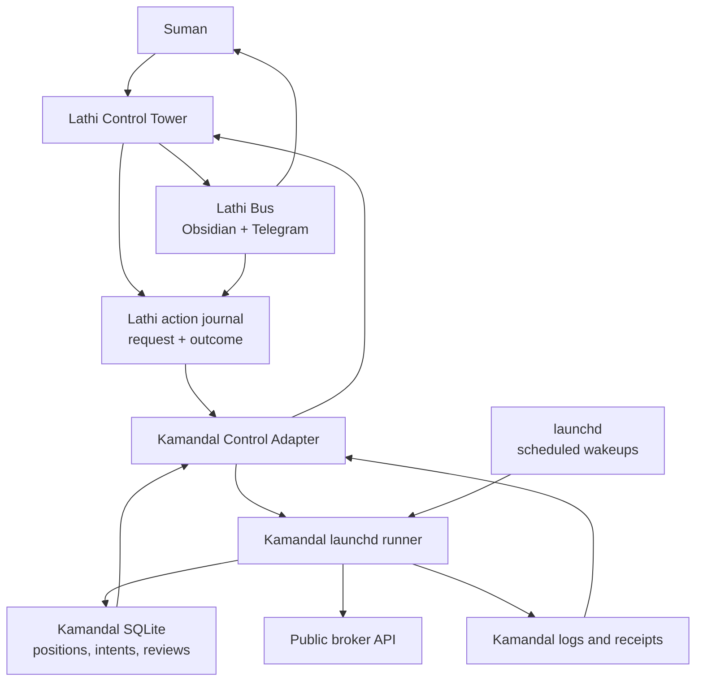
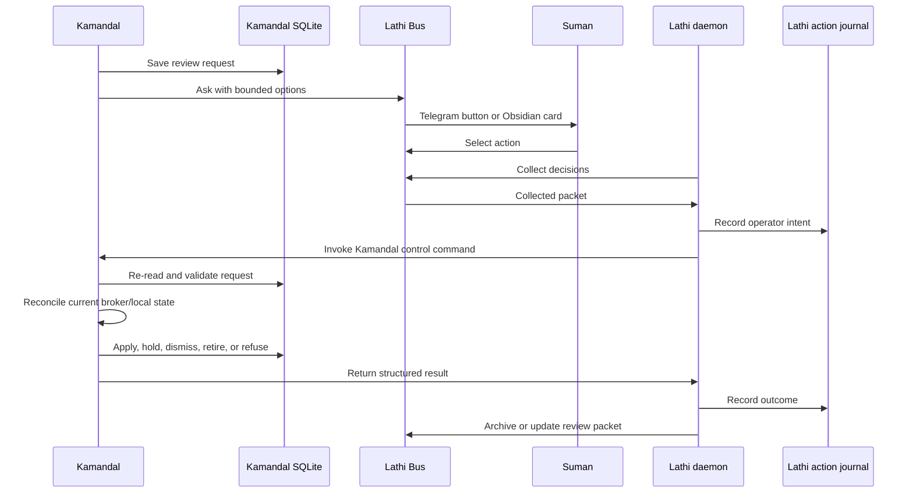

# Kamandal Jobs in Lathi Control Tower

## Purpose

Kamandal owns its trading logic, launchd jobs, reconciliation policy, and broker
safety checks. The missing piece is the same operator cockpit pattern that
Bhiksha is adopting: Suman should be able to open Lathi Control Tower, see
whether Kamandal is healthy, understand which jobs are stale or blocked, and
apply bounded human decisions without relying on Lane Host as the Telegram
poller or operator surface.

The intended design is:

```text
Kamandal is the trading engine.
launchd is the scheduled clock.
Lathi is the operating cockpit and action journal.
Lathi Bus is the human surface protocol.
```

Update 2026-06-30: Lathi is also the mobile decision collector. Kamandal
continues to create review requests and apply/refuse decisions through its own
validated command. Lathi mirrors each active request to one Telegram button card,
collects Suman's phone press, journals the operator intent, and calls
`kamandal_v2.tools.launchd_control apply-review-decision` with request id,
selected action, action id, and subject fingerprint. Lane Host/Jasper is
tombstoned as a Telegram poller for this path.

Lathi may own the visible button, action journal event, worker dispatch, retry
state, and Control Tower card. Kamandal still owns the trading-safe command, the
meaning of success or failure, and every broker-impacting validation.

### Long-term app bridge pattern

Kamandal should be the first full `external_app_bridge`, not a one-off
Kamandal adapter. Bhiksha proved the simpler observe/control shape. Kamandal
adds a second channel: human review requests that must round-trip back into the
owning app before any domain mutation happens.

The generic bridge has two lanes:

| Lane | Owned by | Purpose | Lathi responsibility | App responsibility |
| --- | --- | --- | --- | --- |
| Observability/control | App + Lathi projection | Show runtime truth and run bounded operational commands. | Render status, journal the click, call the app command, show outcome. | Produce status JSON, enforce command gates, return app-owned receipts. |
| Review/decision | App + Lathi Bus + Lathi daemon | Carry human decisions back to the app. | Collect decision, journal operator intent, dispatch to decision command, archive/update surface. | Create review request, define allowed actions, validate fingerprint/expiry/current state, apply or refuse. |

The reusable source config should therefore support:

```toml
[sources.kamandal]
kind = "external_app_bridge"
display_group = "C"
repo_root = "/Users/sunny/Documents/kamandal_v2"
status_command = [".venv/bin/python", "-m", "kamandal_v2.tools.launchd_status", "--json"]
action_command = [".venv/bin/python", "-m", "kamandal_v2.tools.launchd_control", "{action}", "--json"]
review_queue_command = [".venv/bin/python", "-m", "kamandal_v2.tools.review_queue", "--json"]
decision_command = [".venv/bin/python", "-m", "kamandal_v2.tools.launchd_control", "apply-review-decision"]
```

Lathi must not hard-code Kamandal-specific trading semantics. It should know how
to call a configured source, render units, and carry an operator decision. The
payload must carry enough correlation for Kamandal to defend itself:

- `schema`;
- `source_id`;
- `generated_at`;
- `action_id` or `decision_id`;
- `request_id`;
- `subject_id`;
- `subject_fingerprint`;
- `allowed_actions`;
- `expires_at`;
- `risk_class`;
- `requires_confirmation`;
- `result_status`;
- `receipt_ref`.

The important safety rule is that Lathi's journal is proof of operator intent,
not proof of trading mutation. Kamandal's SQLite event/receipt remains the
domain proof for applied, refused, stale, expired, or already-applied decisions.

## Current State

### Kamandal

Kamandal already owns the active launchd schedule on oldmac.

| Label | Schedule | Purpose |
| --- | --- | --- |
| `com.kamandal.v2.x_bookmarks` | Weekdays 08:55 CT | Import X bookmarks into the idea pipeline. |
| `com.kamandal.v2.youtube` | Weekdays 09:15, 11:45, 14:30 CT | Import YouTube/transcript intelligence. |
| `com.kamandal.v2.my_ideas` | Weekdays 08:05, 09:20 CT | Import operator ideas. |
| `com.kamandal.v2.live_reconciliation` | Weekdays 08:35, 10:30, 12:30, 14:30 CT | Reconcile local live groups against Public broker state. |
| `com.kamandal.v2.live_advisory` | Weekdays 09:25, 11:55, 14:40 CT | Build live advisory rows when health gates allow entries. |
| `com.kamandal.v2.live_approved_orders` | Weekdays every 5 minutes, 09:00-15:15 CT | Submit approved live entry intents. |
| `com.kamandal.v2.live_management` | Weekdays every 15 minutes, 09:00-15:15 CT | Evaluate exit policy and submit close intents. |
| `com.kamandal.v2.live_health_report` | Weekdays 09:10, 11:45, 14:45, 15:20 CT | Summarize live health and notify only when attention is needed. |
| `com.kamandal.v2.scheduled_job_health` | Weekdays every 15 minutes, 09:15-15:30 CT | Watch Kamandal launchd logs for stale, missing, or failed runs. |
| `com.kamandal.v2.earnings` | Weekdays 08:40 CT | Refresh earnings/event data. |
| `com.kamandal.v2.iv` | Weekdays 08:45 CT | Refresh IV data. |
| `com.kamandal.v2.iv_afternoon` | Weekdays 14:45 CT | Refresh afternoon IV data. |
| `com.kamandal.v2.weekly_reviewer` | Fridays 10:00 CT | Review rejected candidates and propose playbook tuning. |

The one scheduled-job runner is:

```bash
PYTHONPATH=src python3 -m kamandal_v2.tools.launchd_job <job>
```

The runner prints a structured observation line:

```text
KAMANDAL_LAUNCHD_JOB={...json...}
```

That line is the first observation contract for Lathi. It lets Control Tower
render job status and lets a future manual Control Tower action capture a
Kamandal-owned result without reimplementing trading logic.

Kamandal also has these operator-safety pieces today:

| Piece | Status | Notes |
| --- | --- | --- |
| Launchd installer | Implemented | `scripts/launchd/install_kamandal_launchd.sh install|uninstall|uninstall-cron` writes plists and keeps the old cron block out of the active path. |
| Launchd runner | Implemented | `kamandal_v2.tools.launchd_job` owns trading-day skips, subprocess execution, stdout/stderr tails, failure alerts, and the `KAMANDAL_LAUNCHD_JOB` result line. |
| Live health | Implemented | `.venv/bin/kamandal live-health --json` and `live-health-report` summarize book health and block entries on RED by policy. |
| Scheduled job health | Implemented | `scheduled-job-health` reads launchd logs and alerts only when a job is missing, stale, unreadable, wrong, or failed. |
| Lathi Bus receipts | Implemented | `kamandal_v2.ops.alerts.send_lathi_alert` supports `off`, `spool`, and `live`; live mode requires `network_call_performed=true`. |
| Alert compaction | Implemented | Kamandal clips verbose failure bodies before Lathi Bus delivery and leaves full output in launchd logs. Lathi Bus should still own a shared transport hard cap. |
| Operator review requests | Implemented | Ambiguous reconciliation requests are stored in SQLite, sent via Lathi Bus `telegram-ask`, and can be applied by `kamandal review <request_id> <action> [note]`. |
| Reconciliation auto-repair | Implemented | Proven-safe cases are handled by Kamandal without asking Suman; ambiguous cases become bounded review requests. |
| Lane Host dependency | Transitional | Some Telegram token fallbacks and live collection assumptions still point at Lane Host-era files. This is a compatibility bridge, not the target architecture. |

### Lathi

Lathi is the operating core. It owns daemon discipline, action journals, worker
dispatch, read models, and Control Tower. It should observe and safely invoke
Kamandal-owned commands through an explicit adapter. It should not become a
second trading engine.

The clean extension is not "move Kamandal trading jobs into Lathi." The clean
extension is "teach Lathi to observe and safely invoke Kamandal-owned jobs and
review decisions through explicit, versioned commands."

### Lathi Bus

Lathi Bus is the human surface protocol. It owns publish, ask, collect, archive,
Obsidian drawer contracts, Telegram receipts, and content-bound callbacks. It
should not own trading semantics, job scheduling, broker actions, or a separate
business ledger.

Target Kamandal profile shape:

```text
06 Lathi/A. Kamandal/Inbox
06 Lathi/A. Kamandal/Archive
_system/lathi-bus/kamandal/receipts
_system/lathi-bus/kamandal/collected
```

The current `kamandal-northstar` profile is transitional if it points at an
OpenClaw/Lane Host drawer. The target is a Kamandal drawer under `06 Lathi`,
with Lathi as the sole live decision collector.

## Desired Feature State

Control Tower should have a Kamandal section under the trading job family. It
should show all Kamandal launchd jobs, the live book health, current
reconciliation posture, pending human decisions, and the latest notification
transport state in one place.



The operator experience should support these use cases:

1. See whether each Kamandal launchd label is installed and recently healthy.
2. See whether the live book is GREEN, YELLOW, RED, or NO_DATA.
3. See why entries are blocked, including BPR, reconciliation, stale close, and
   loss-watch reasons.
4. See pending reconciliation review requests and their expiry.
5. Click "Run Live Health Now" and receive the same JSON/status Kamandal would
   produce from its own CLI.
6. Click "Send Pending Review Requests" to ask Kamandal to re-send unsent review
   cards through Lathi Bus.
7. Click a bounded review action such as `hold`, `dismiss`, or `retire_local`,
   with Kamandal revalidating the request before applying it.
8. See an action journal entry for every Control Tower initiated action.
9. See scheduled job failures even when launchd, not Lathi, started the job.

Control Tower should not infer trading truth from Telegram alone. Telegram is an
attention surface. Runtime status, SQLite state, Kamandal receipts, launchd logs,
and broker-confirmed reconciliation are the evidence.

## Decision Flow: Reconciliation Review

The confusing part is the handoff after Suman chooses an option. The target
answer is: Lathi reads the human decision through Lathi Bus, records it as an
operator intent, then invokes a Kamandal-owned command. Kamandal applies or
refuses the action after revalidating its own state.



### 1. Kamandal creates the request

During live reconciliation, Kamandal decides whether an issue is auto-repairable
or ambiguous.

- Auto-repairable issues are handled inside Kamandal without asking Suman.
- Ambiguous issues become rows in Kamandal SQLite `operator_review_requests`.
- The request includes a stable `request_id`, `request_type`, `subject_id`,
  summary, allowed actions, payload, creation time, and expiry time.

At this point, Kamandal is still the source of truth. Lathi Bus has not made a
decision; it is only about to show a decision surface.

### 2. Kamandal publishes the human surface

Kamandal sends the request through Lathi Bus:

```text
kamandal review request
  -> lathi-bus telegram-ask or Obsidian ask
  -> visible card with bounded actions
```

For Telegram, the button values should be content-bound, for example:

```text
kamandal:review:<request_id>:<action>
```

The Lathi Bus packet should preserve the visible body hash, selected option,
message id or note id, and source provenance. Lathi Bus still does not apply the
decision. It only creates and later collects a human-surface packet.

### 3. Suman chooses an option

Suman can choose from Telegram or Obsidian.

- Telegram: tap a bounded button.
- Obsidian: mark the decision in the review packet.
- Fallback: run or send the text command `kamandal review <request_id> <action>
  [note]`.

The fallback remains important during cutover. It means a stuck Telegram
collector does not block reconciliation forever.

### 4. Lathi reads the decision

In the target architecture, Lathi is the only live collector. It owns the daemon
tick that asks Lathi Bus for collected decisions.

```text
Lathi daemon
  -> Lathi Bus collect Telegram/Obsidian
  -> normalized collected packet
  -> Lathi action journal
```

For Telegram this requires Lathi to be the sole `getUpdates` poller for the bot
token. Lathi Bus provides the collector primitives and packet format; Lathi owns
when collection runs, where the decision is journaled, and what worker receives
the result.

### 5. Lathi dispatches to Kamandal

After Lathi records the operator intent, it invokes Kamandal through the external
source adapter:

```bash
PYTHONPATH=src python3 -m kamandal_v2.tools.launchd_control \
  apply-review-decision \
  --request-id <request_id> \
  --action <action> \
  --source lathi \
  --action-id <lathi_action_id> \
  --json
```

This command is Kamandal's Phase 1 bridge contract. The existing fallback
command remains useful during manual recovery:

```bash
kamandal review <request_id> <action> [note]
```

### 6. Kamandal validates and applies

Kamandal must not trust the button press blindly. The control command should:

1. Re-read `operator_review_requests` from Kamandal SQLite.
2. Refuse unknown, already-applied, expired, or disallowed actions.
3. Verify the request still matches the current local/broker reconciliation
   issue.
4. Verify the collected packet source hash when Lathi supplies one.
5. Apply the domain action only if the current state still allows it.
6. Write the final request status and an event row back to Kamandal SQLite.
7. Return a structured result to Lathi.

That is the key safety boundary: Lathi carries intent, but Kamandal performs the
irreversible domain decision.

### 7. Lathi records outcome and cleans the surface

Lathi records the command result in its action journal. Then it asks Lathi Bus to
archive or update the review packet.

The operator should be able to see:

- original review request;
- selected action;
- who/what collected it;
- Lathi action id;
- Kamandal command result;
- whether the request was applied, held, dismissed, retired, expired, or refused.

### Current transitional behavior

Today Kamandal can create review requests, send Lathi Bus `telegram-ask` cards,
parse deterministic button/text payloads, and apply decisions through either the
Kamandal fallback command or the `launchd_control apply-review-decision` bridge
command. The target Lathi-owned live collector is still pending cutover.

Until the Lathi-owned live collector cutover is complete:

- Telegram/Obsidian can show the decision request.
- Fallback text/manual CLI remains the reliable apply path.
- Lane Host-era polling and secret fallbacks are compatibility only.
- The architecture should move toward Lathi as the sole collector, not a
  separate Lathi Bus business daemon.

## Kamandal Development Contract

### 1. Keep the launchd job registry explicit

Partially implemented. The current schedule is declared in
`kamandal_v2.tools.launchd_job`, and the launchd installer consumes the same job
set. This should become a small reusable registry module if Lathi integration
needs richer metadata.

Suggested target module:

```text
src/kamandal_v2/ops/launchd_registry.py
```

Each job record should include:

- launchd label;
- Kamandal runner job name;
- schedule label for humans;
- trading-day skip behavior;
- log file paths;
- risk class;
- allowed manual actions;
- whether the action is safe during market hours;
- the command line Lathi should call.

This avoids Lathi scraping shell scripts or hard-coding Kamandal schedules.

### 2. Add a Kamandal status snapshot command

Not implemented as a dedicated command yet. The underlying data exists through
`launchd_job.scheduled_job_health`, `kamandal live-health --json`, launchd logs,
and SQLite. The Control Tower contract should expose it as one read-only command:

```bash
PYTHONPATH=src python3 -m kamandal_v2.tools.launchd_status --json
```

The output should contain one JSON object with:

- schema name, generated timestamp, host, repo root, and database path;
- one row per active `com.kamandal.v2.*` launchd label;
- `loaded`, `enabled`, and last launchd exit state where available;
- last `KAMANDAL_LAUNCHD_JOB` payload parsed from stdout logs;
- stderr/out tail paths, not secret contents;
- latest live-health summary and entry gate;
- latest reconciliation issue counts;
- pending/sent operator review request counts and expiry windows;
- latest alert/transport attempt summary, including whether Lathi Bus live send
  succeeded;
- status of the Lathi Bus profile used by Kamandal, if cheap to check.

The status shape should distinguish domain health from transport health. For
example, the book can be GREEN while Telegram delivery is degraded. Control
Tower should render that as "Kamandal healthy; alert transport degraded," not
as a trading failure.

### 3. Add a Kamandal control command

Not implemented as a single command yet. Several underlying actions already
exist as CLIs or modules. The target command is:

```bash
PYTHONPATH=src python3 -m kamandal_v2.tools.launchd_control <action> --json
```

Initial actions:

| Action | Underlying Kamandal behavior | Gate |
| --- | --- | --- |
| `live-status` | `.venv/bin/kamandal live-health --json` or direct `run_live_health` | Read-only. |
| `scheduled-job-health-now` | `launchd_job scheduled-job-health --force --alert-mode spool|live` | No broker action. |
| `live-health-report-now` | `launchd_job live-health-report --force` | No broker action; may notify only when attention policy says so. |
| `send-pending-review-requests` | `kamandal send-operator-review-requests` | No broker action; sends review cards only. |
| `retry-job --job x-bookmarks` | Trigger `com.kamandal.v2.x_bookmarks` through launchd, with detached runner fallback for dev. | No broker action; retries X intelligence ingestion only. |
| `retry-job --job youtube` | Trigger `com.kamandal.v2.youtube` through launchd, with detached runner fallback for dev. | No broker action; retries YouTube intelligence ingestion only. |
| `apply-review-decision` | `kamandal review <request_id> <action> [note]` | Requires request id, allowed action, non-expired request, and Kamandal revalidation. |

Actions that submit, cancel, or modify broker orders should not be exposed as
one-click Control Tower buttons in the first phase. If they are added later,
they need an explicit confirmation gate and app-side preflight.

`retry-job` exists because `x-bookmarks` and `youtube` can fail for external
reasons such as Codex auth or transcript/provider outages. These retries should
be visible as Control Tower buttons, but they remain app-owned Kamandal
commands. They should not become a generic "rerun anything" Lathi action.

For YouTube specifically, a run that completes discovery and fetch attempts but
finds no usable transcripts should drain as a clean no-op by default. That
keeps source/content misses from turning into persistent Lathi infrastructure
red. Internal failures, LLM extraction failures after a transcript exists, and
explicit debug runs with `KAMANDAL_YOUTUBE_EMPTY_TRANSCRIPTS_STATUS=failed`
still fail closed.

`retry-job` is a trigger-style action. Kamandal validates the requested job,
kicks the corresponding launchd label, and returns quickly with
`status=triggered`. Lathi should treat that as the completed operator receipt;
the later job result is reported by the normal Kamandal launchd status/health
rows after source refresh. This keeps the operator workflow short: click one or
more safe intelligence retries, see that each trigger was accepted, and move on.

The command should accept or create an `action_id` and echo it in every result:

```text
operator click -> Lathi action journal -> Kamandal control command -> Kamandal receipt
```

Manual controls should be concurrency-safe. If the same action is already
running, Kamandal should refuse with the in-flight action metadata rather than
starting duplicate reviews or health checks.

### 4. Persist observed scheduled outcomes

Partially implemented. Scheduled launchd runs are visible through stdout logs
that contain `KAMANDAL_LAUNCHD_JOB={...}`. The status command should optionally
write a compact derived snapshot:

```text
data/logs/launchd/latest_status.json
```

This file should be derived from non-secret receipts and log summaries. Lathi
can call `launchd_status --json`, but a compact latest-status file makes the
dashboard faster and more stable when shelling out is undesirable.

### 5. Keep Kamandal alert ownership

Kamandal should continue deciding when an operational event deserves attention.
Lathi may expose alert outcomes and observe stale sources, but it should not
duplicate Kamandal's own alerts. Otherwise one reconciliation blocker or launchd
failure could become two noisy Telegram messages.

The policy is:

- healthy/self-handled work stays in logs and JSON;
- auto-repaired reconciliation can become a receipt or daily digest;
- ambiguous reconciliation becomes a bounded review request;
- broker-impacting actions remain Kamandal-owned and revalidated.

## Lathi Development Contract

### 1. External observed source adapter

Lathi already has the generic shape for systems it observes but does not own.
Kamandal should become another external observed source next to Bhiksha.

Target configuration:

```text
source id: kamandal
display group: C / Trading
status command: python -m kamandal_v2.tools.launchd_status --json
action command: python -m kamandal_v2.tools.launchd_control <action> --json
repo root: oldmac Kamandal checkout path
timeout: short for status, longer for explicit manual actions
redaction policy: default
```

This keeps Lathi generic. It learns how to host external job cards, not how to
trade.

### 2. Control Tower state

The Control Tower snapshot should include Kamandal observed jobs next to other
pack/kernel/external units.

Fields should map cleanly onto existing tower ideas:

- `unit_id`: Kamandal launchd label, health unit, or review queue unit;
- `kind`: `external_launchd_job`, `external_health`, or `external_review_queue`;
- `serves_job`: `C` or `trading`;
- `declared_enabled`;
- `effective_enabled`;
- `lifecycle`: `armed`, `running`, `waiting_you`, `stuck`, `idle`, or `retired`;
- `schedule`;
- `next_fire` if known;
- `last_run_status`;
- `last_run_at`;
- `findings`;
- `available_actions`;
- `risk_class`;
- `source_id`: `kamandal`.

The tower renders Kamandal status, but Kamandal receipts and commands remain the
evidence.

Live-health findings are source-truth reconciled, not append-only notices. A
finding may still reach Blackboard when it first appears, but Kamandal must clear
it from the source contract once the app handles it. For stale local entry
approvals, Kamandal self-retires prior-market-day `pending_approval` tickets as
`retired_stale_entry_approval`; the next `launchd_status` output should then
return `kamandal:live-health` without that finding so Lathi drops the Blackboard
line automatically.

The live-health unit includes these extra fields for downstream surfaces:

- `finding_details`: structured current events with reason, detail, severity,
  and `operator_state` when applicable.
- `self_healing`: bounded actions Kamandal already performed while building
  the status, such as retired stale entry approvals.
- `operator_state`: `clear`, `operator_needed`, `self_healing`, or
  `blocked_self_healing`.

### 3. Review queue and decision dispatch

Kamandal should expose a read-only review queue command separate from the
general status command. The review queue returns the active human-decision
requests Lathi should render as `waiting_you` units.

Suggested queue output shape:

```json
{
  "schema": "kamandal.review_queue.v1",
  "generated_at": "2026-06-30T12:00:00+00:00",
  "review_requests": [
    {
      "request_id": "or_...",
      "status": "pending",
      "summary": "Retire stale local group?",
      "subject_id": "live_group_...",
      "subject_fingerprint": "sha256:...",
      "allowed_actions": ["hold", "dismiss", "retire_local"],
      "expires_at": "2026-06-30T13:00:00+00:00",
      "risk_class": "trading_review",
      "action_requirements": {
        "retire_local": {
          "requires_confirmation": true,
          "reason": "This mutates Kamandal's local live-group state."
        }
      }
    }
  ]
}
```

When Suman chooses an option, Lathi calls the configured decision command. The
target command should accept at minimum:

```bash
--request-id <request_id> \
--action <allowed_action> \
--source lathi \
--action-id <lathi_action_id> \
--json
```

Kamandal must then re-read SQLite, verify the request is still current, verify
the action is allowed, verify expiry/fingerprint/current broker-local state, and
return a structured receipt. Lathi records the result but does not invent a
domain outcome.

### 4. Human-surface collection inside Lathi

Lathi should own the live human-decision collection loop. Lathi Bus should
provide the surface protocol and collector primitives. Lane Host should not be
the future `getUpdates` owner.

Target flow:

```text
Kamandal creates review request
  -> Kamandal sends/references Lathi Bus ask packet
  -> Lathi daemon collects Telegram or Obsidian decision through Lathi Bus
  -> Lathi writes action journal entry
  -> Lathi dispatches to Kamandal control command
  -> Kamandal validates and applies or refuses
  -> Lathi records outcome and archives/updates the surface packet
```

The app-side validation is mandatory. A collected button press is an operator
intent, not permission for Lathi Bus to mutate trading state directly.

### 5. Avoid making Lathi the Kamandal scheduler

Lathi has scheduler primitives, but Kamandal scheduled wakeups should stay in
Kamandal-owned launchd jobs for now because:

- launchd already handles reboot recovery;
- Kamandal performs trading-day and market-safety checks;
- duplicate schedulers create split-brain risk;
- oldmac runtime evidence already depends on Kamandal logs, SQLite, and receipts.

Lathi can observe scheduled outcomes and run bounded manual actions. It should
not become the primary Kamandal scheduler in this slice.

## Lathi Bus Development Contract

### 1. Move Kamandal's human drawer under `06 Lathi`

The target drawer should be owned by the shared Lathi Bus profile config, not by
OpenClaw/Lane Host conventions.

Recommended profile:

```toml
[profiles.kamandal-control-tower.obsidian]
human_root = "06 Lathi/A. Kamandal"
inbox = "Inbox"
archive = "Archive"
system_root = "_system/lathi-bus/kamandal"
receipts = "receipts"
collected = "collected"

[profiles.kamandal-control-tower.telegram]
bot_purpose = "interaction"
bot_ref = "jasper_receipts"
target_ref = "operator_dm"
system_root = "_system/lathi-bus/kamandal"
outbox = "telegram-outbox"
receipts = "receipts"
collected = "collected"
live_send_enabled = true
live_collect_enabled = true
```

`live_collect_enabled=true` is only correct after Lathi is the sole live poller
for that bot token. Until then, Kamandal can send through Lathi Bus but decision
collection must use the fallback command path or a Lathi-owned collector.

### 2. Keep Lathi Bus thin

Lathi Bus should:

- render readable review cards;
- send Telegram receipt/button messages;
- bind callbacks to message content and source hash;
- collect selected options and comments;
- archive resolved packets.

Lathi Bus should not:

- decide whether reconciliation is safe;
- run Kamandal CLIs directly;
- store the app action journal;
- retry broker-impacting work;
- own a second daemon beside Lathi.

## Deployment Phases

### Phase 1: Kamandal status/control contract

Goal: make Kamandal observable and controllable without changing scheduled
ownership.

Build in Kamandal:

- `kamandal_v2.ops.launchd_registry`;
- `kamandal_v2.tools.launchd_status --json`;
- `kamandal_v2.tools.launchd_control <action> --json`;
- `kamandal_v2.tools.review_queue --json`;
- `launchd_control apply-review-decision --request-id ... --action ... --json`;
- optional `data/logs/launchd/latest_status.json`;
- action ids and per-action concurrency guards;
- request ids, subject fingerprints, expiry checks, and idempotent decision
  receipts;
- tests proving redaction, JSON validity, gates, and no broker mutation during
  read-only actions.

Do not build yet:

- moving Kamandal schedules into Lathi;
- Lathi-owned broker submission or cancellation;
- unconfirmed trading-impacting buttons;
- duplicate Telegram alerts from both Kamandal and Lathi.

Operator result:

- Suman can open Control Tower and see Kamandal health and job state.
- Scheduled launchd jobs continue exactly as before.
- Control Tower actions call Kamandal-owned commands with durable action ids.

### Phase 2: Lathi Control Tower adapter

Goal: render Kamandal in Lathi next to Bhiksha.

Build in Lathi:

- explicit Kamandal external source config;
- generic `external_app_bridge` support for status, action, review queue, and
  decision commands;
- Control Tower cards for Kamandal jobs, live health, and review queue;
- action journal records for Kamandal actions;
- decision journal records that distinguish operator intent from app mutation;
- confirmation behavior for any action that can affect trading state;
- stale-source detection that does not duplicate Kamandal alerts.

Operator result:

- Suman can distinguish "Kamandal failed" from "Lathi cannot observe Kamandal."
- The dashboard becomes the first place to look during market hours.

### Phase 3: Lathi-owned human decision collection

Goal: retire Lane Host as the live Telegram decision owner.

Build across Lathi and Lathi Bus:

- move Kamandal profile under `06 Lathi/A. Kamandal`;
- make Lathi the sole `getUpdates` poller for the relevant interaction bot;
- collect Telegram and Obsidian decisions into Lathi action journal;
- dispatch collected decisions to Kamandal `launchd_control`;
- archive/update Lathi Bus packets after Kamandal returns a result.

Cutover guard:

- stop or disable Lane Host polling before enabling Lathi live collection;
- verify one test callback end-to-end;
- keep a rollback path to fallback text commands.

### Phase 4: Guarded recovery controls

Goal: make Control Tower useful for real recovery, not only readback.

Possible later actions:

- rerun live reconciliation now;
- rerun live management now;
- retry sending pending review requests;
- clear or expire stale local-only review rows;
- request a non-broker health refresh.

Broker order submit, cancel, replace, or close actions remain a separate design
decision with explicit approval gates.

## Development Ownership

This should be developed as a three-repo contract.

Kamandal should own:

- launchd registry and installer truth;
- `launchd_status --json`;
- `launchd_control --json`;
- live health and scheduled health semantics;
- reconciliation and review-request semantics;
- action ids, concurrency behavior, and command result schema;
- tests proving no secrets leak and every action uses Kamandal-owned logic.

Lathi should own:

- generic external observed source rendering;
- Control Tower cards;
- operator action journal or kernel-backed intent path;
- confirmation UI and risk rendering;
- worker dispatch and retry behavior;
- correlation between Lathi action ids and Kamandal receipts;
- observer-level stale-source detection.

Lathi Bus should own:

- profile and drawer contracts;
- Obsidian and Telegram rendering;
- content-bound callbacks;
- collection packets;
- archive behavior.

Codex should supervise the integration boundary and end-to-end oldmac proof.
Kamandal work should stay in Kamandal because it knows the trading runtime.
Lathi work should stay in Lathi because it owns the broader control plane.
Lathi Bus work should stay in Lathi Bus because it owns the shared surface
protocol.

## Verification

### Phase 1 verification

Phase 1 is working when all of these are true on oldmac:

1. `python -m kamandal_v2.tools.launchd_status --json` returns all active
   `com.kamandal.v2.*` jobs with no secrets and valid JSON.
2. The status command includes live health, scheduled job health, review queue
   counts, and transport state as separate fields.
3. `python -m kamandal_v2.tools.launchd_control live-status --json` returns the
   same live-health result without broker mutation.
4. `scheduled-job-health-now` uses Kamandal's existing health logic and does not
   submit, cancel, or modify broker orders.
5. `send-pending-review-requests` only sends bounded review cards.
6. `apply-review-decision` refuses expired, unknown, or disallowed actions.
7. Existing launchd schedules still run without Lathi owning the clock.

### Phase 2 verification

Phase 2 is working when all of these are true:

1. Control Tower renders Kamandal jobs under the trading group.
2. Control Tower shows Kamandal live health without parsing Telegram messages.
3. Every Control Tower initiated action has a durable Lathi request and outcome
   record.
4. Every Lathi action outcome links to the Kamandal command result or receipt.
5. Stale observer state is distinct from a Kamandal job failure.
6. No duplicate Telegram alerts are sent for one Kamandal failure.

### Phase 3 verification

Phase 3 is working when all of these are true:

1. Lane Host is not polling the shared interaction bot.
2. Lathi is the sole live callback collector for the bot token.
3. A Telegram button press becomes a Lathi action journal entry.
4. The Lathi action dispatch calls Kamandal's control command.
5. Kamandal validates the request, applies or refuses it, and returns a result.
6. Lathi Bus archives or updates the review packet after the result.

## One Sentence to Remember

Kamandal should continue to own trading behavior, while Lathi becomes the place
where Suman sees, audits, and safely triggers Kamandal-owned operations through
Lathi Bus surfaces.
